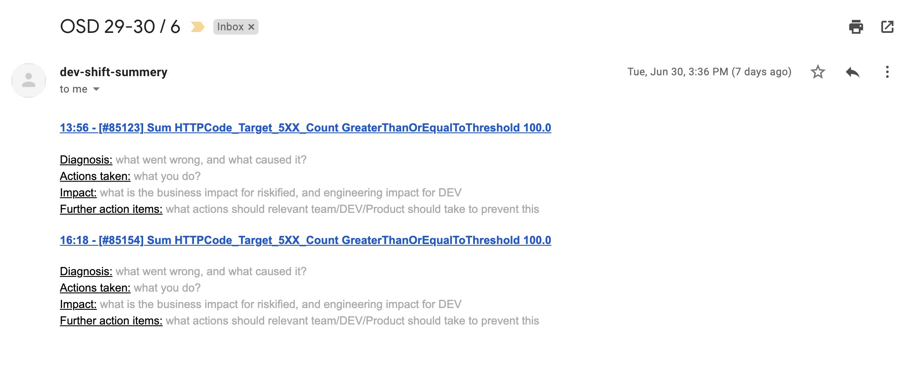

# Pager duty integration
## overview
This repo includes a set of tools to eliminate toil related to working with pager duty in large teams.

Those tools were design to help the way we work with pagerduty, and might no be "for everyone" 

## Tool #1:  Automated Shift Summery Report
### Overview
We instruct our shifters to send an summery email with everything happened during the shift.

The goal for it being:
1. knowledge sharing - we wand people to know how incidents were handles and their impact.
2. identifying problematic alert schemas - this is a good way for production owners to identify noisy/ sensitive alerts.   

Report email example:


In the way we work, we instruct our shifters to fill out the actions taken, impact etc, and this tool generates the incidents templates for them.

### Running it
Required environment variables:
* `ESCALATION_POLICY_ID` - the escalation policy for which we want to generate the summery. 
The id can be found in the url of the pagerduty escalation policy view `pagerduty.com/escalation_policies#<The Key>`
* `SCHEDULE_ID` - the schedule from which we should get the on call responders - the recipients of the summery email are derived from the on calls of the given timeframe.
The id can be found in the url of the pagerduty schedule view `pagerduty.com/schedules#<THE Key>`
* `PD_TOKEN` - the integration token generated by pagerduty

Optional environment variables:
* `EMAIL_TOKEN` - if you wish to use the available Sendgrid emailing, just add your email token and viola.
* `RECIPIENT_EMAIL` - if you wish the email to be sent to a static address (such as dev@mycompany.com for example, or the service owner), 
you can specify the email address here
* `EMAIL_SUBJECT` - the subject of the generated email, will be _Shift summery_ by default.  
The subject will be sufixed by the date timeframe in the following format: `DD-DD/MM` (start day-end day / month)

The shift summery should be run using docker:
```
docker run --env PD_TOKEN=??? \
           --env ESCALATION_POLICY_ID=??? \
           --env SCHEDULE_ID=??? \
           --env EMAIL_TOKEN=??? \
           shift-summery:latest
```

### Changing the template
We're generating the report using [erb](https://www.stuartellis.name/articles/erb/). It is easy to change the template of the generated report by editing the [summery_template.html.erb](app/shift_summery/summery_template.html.erb) file.

### Email client
We're using Sendgrid, as our emailing infra, if you wish to use a different one - implement the `EmailClient.send_email(recipient, content)` method differently.

## Tool #2: Open Incident Fetcher
### Overview
A small tool made to fetch all NON resolved incidents within a time frame to be used during a shift hand off. 
### Running it
Still WIP
